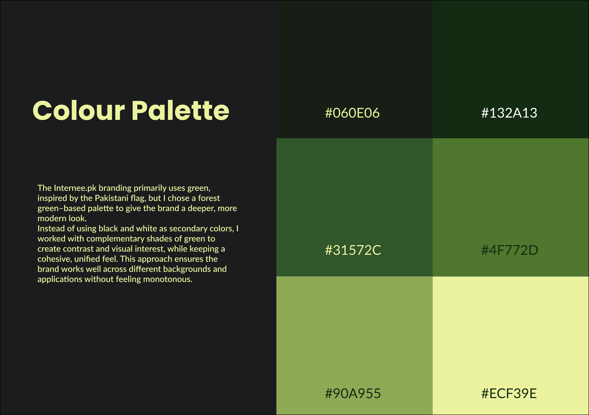
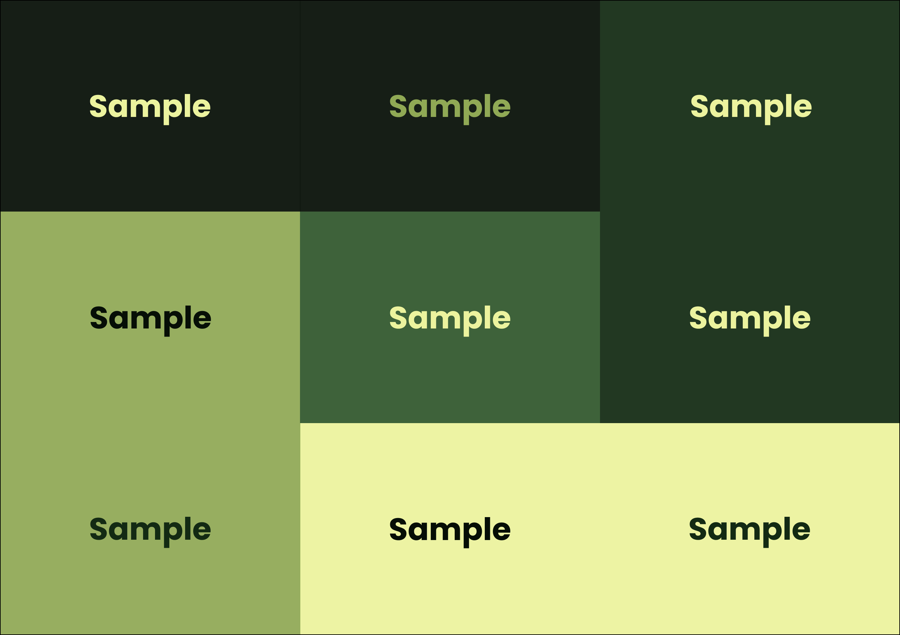
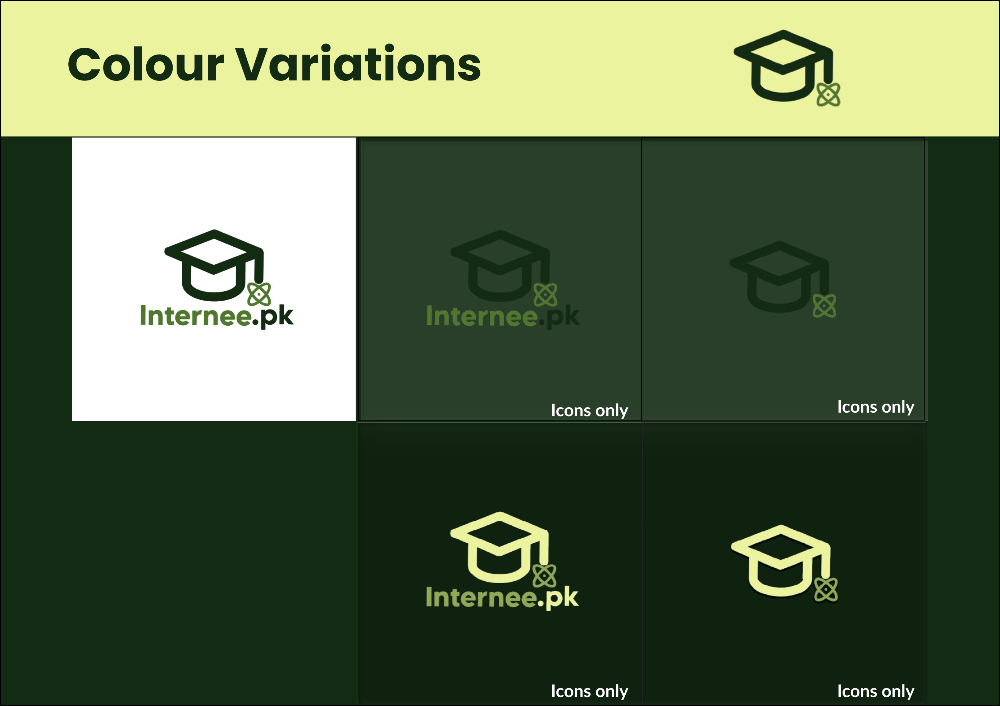
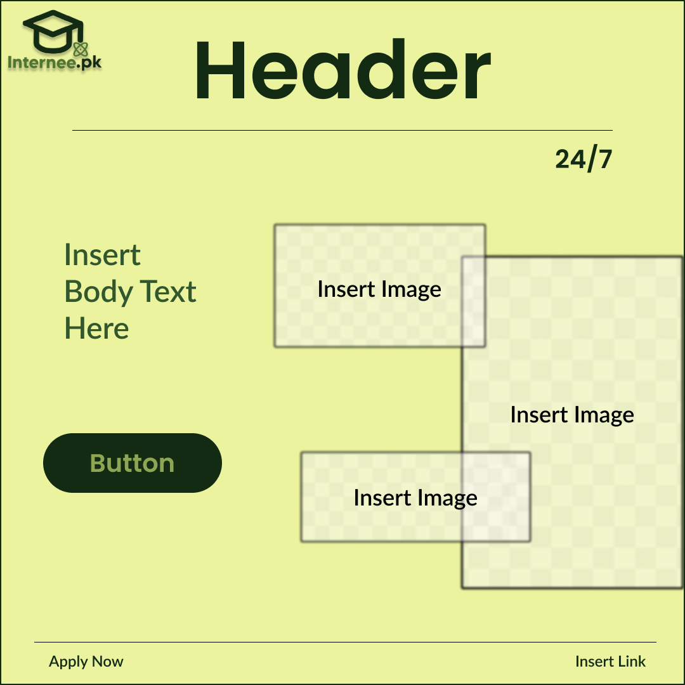
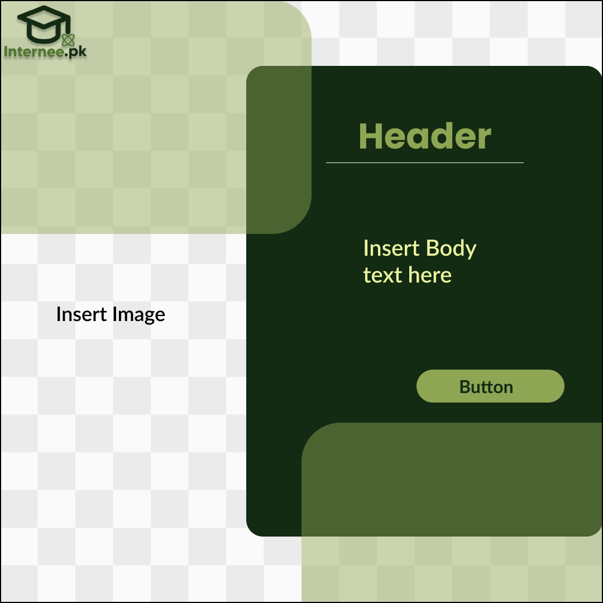
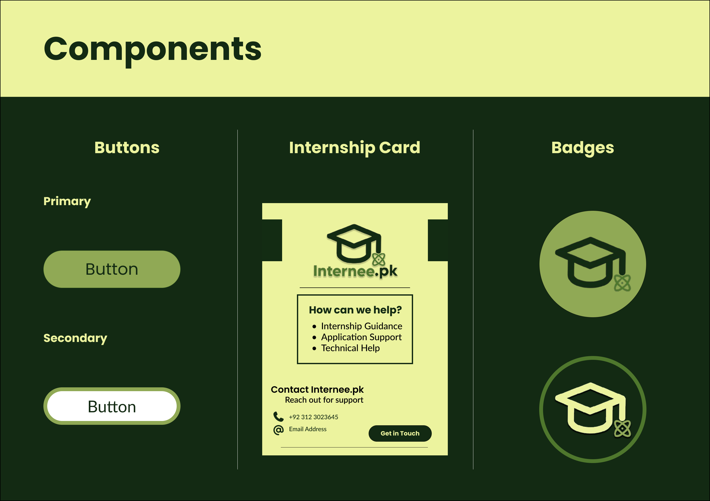

# Internee.pk-Branding-Kit
Branding kit including logos, color palette, typography, and templates for Internee.pk

---

## Brand Overview

---

## Colors
The primary palette uses forest green shades to create a modern, cohesive identity.

---

## Logo
The logo combines a graduation cap and atom symbol in a minimalist, rounded style.

---

## Typography

---

## Social Media Templates

---

## Components

[View full Figma file](https://www.figma.com/design/zfu5KpEBWKXa740EdTXSWR/Internee.pk-Branding-Kit?node-id=2-2&t=LmAWOvc2aDsguN8P-1)
